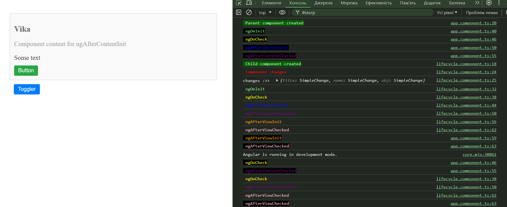

# Angular Lifecycle Hooks Demonstration

This project demonstrates the use of Angular lifecycle hooks within a component. It includes functionality to toggle the component's visibility, allowing observation of the lifecycle hooks in action.

## Console Output Explanation

When you run this project and interact with the toggler button, you'll see various messages logged in the console. These messages correspond to the different lifecycle hooks in Angular, providing insight into the component's lifecycle.

The expected output in the console includes:

- **Child component created**: Logged when the component is instantiated.
- **Component changes**: Logged when any input property changes, along with the details of those changes.
- **ngOnInit**: Logged once after the first `ngOnChanges` method is called.
- **ngDoCheck**: Logged during every change detection run.
- **ngAfterContentInit**: Logged after content projection into the component.
- **ngAfterContentChecked**: Logged after the content has been checked.
- **ngAfterViewInit**: Logged after the component's view has been initialized.
- **ngAfterViewChecked**: Logged after the component's view has been checked.
- **ngOnDestroy**: Logged just before the component is destroyed.

The logs help in understanding the sequence and timing of these lifecycle hooks.
